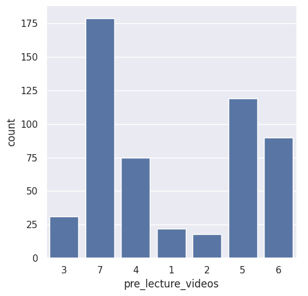
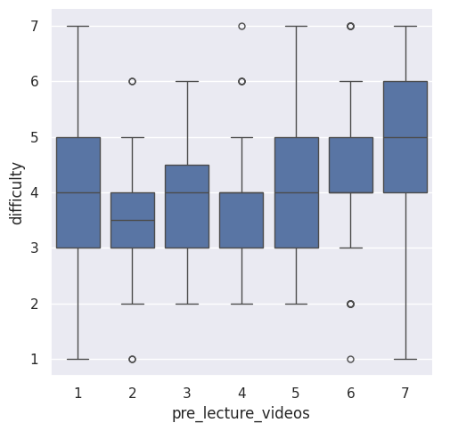
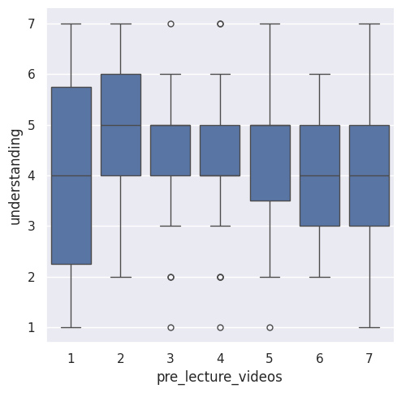

---
# Do not edit the text between these lines!
layout: default
---

# COMP110 Students' Opnion on Pre-Lecture Videos

<!-- This is a comment. Below, you'll see code for inserting an image. To make this image appear, update <custom-path>. To add an image, save it inside the imgs folder of this repository. -->

## Students' opinion on having optional pre-lecture videos

Students filled out a questionnaire that asked them various questions about who they were and their opinions about the class. Answers to the questions about the class ranged from 1, strongly disagree, to 7, strongly agree. This indicates 4 is a neutral opinion on the given statement. When asked if pre-lecture videos would be helpful for their learning, many students agreed. 

## Figure 1

Figure 1 displays Students' opinion on pre-lecture videos. The most common answers are 7, 5, and 6 signifying most students agree that pre-lecture videos should be offered.

## Figure 2

Figure 2 displays the comparison of students' opinion on having pre-lecture videos to their opinion on the difficulty of the class. Those who selected 6 or 7 for pre lecture videos also answered higher when asked how difficult the class was for them. Including pre-lecture videos could be a way to decrease the precieved difficult of the class.

## Figure 3

Figure 3 displays the comparison of students' opinion on having pre-lecture videos to their understanding of the class. Those who prefered pre lecture videos answered they have less understanding of the class. The answer choices to the understanding class question ranged from 1 to 7. 1 signified they did not understand anything and 7 signified they understand everything. This shows that those who feel they would benefit from the videos the most are the ones who have less of an understanding of the class. Therefore, including pre-lecture videos would give these individuals an additional resource to help increase their understanding of the class.

## Final Thoughts 

Overall, the data shows there is a lot of interest in having pre-lecture videos. When comparing this interest to percieved difficulty and understanding of the class, those who said the class was more difficult and/or said they had a poorer understanding of the material also showed more preferance to having pre-lecture videos. Therefore, to help those who find the class more difficult and/or are struggling to understand the class offereing pre-lecture videos could be helpful. Offering this would also be beneficial for those who are unable to attend tutoring or office hours as it would be accessible whenever it is convienent. One potential downside is the addictional effort required from the COMP110 team. Additionally, students aren't guaranteed to utilize this resouce or may choose to use it instead of attending class, decreasing class attendance. Despite this, offering this resource also provides benefits, as mentioned it is something students could come back to at their convenience. Additionally, it would be beneficial for students who have to miss class so they don't fall behind. To discover the benfit of this, it could be offered for a semester and in the end of semester survey, students could be asked about their thoughts on the videos. These questions could include, asking if they utilized the resource, how frequently they used it, and how helpful they found it. Additionally the questions about the percieved difficulty and undertsanding of the course can be evaluated to see if there is an improvement in the responses. 